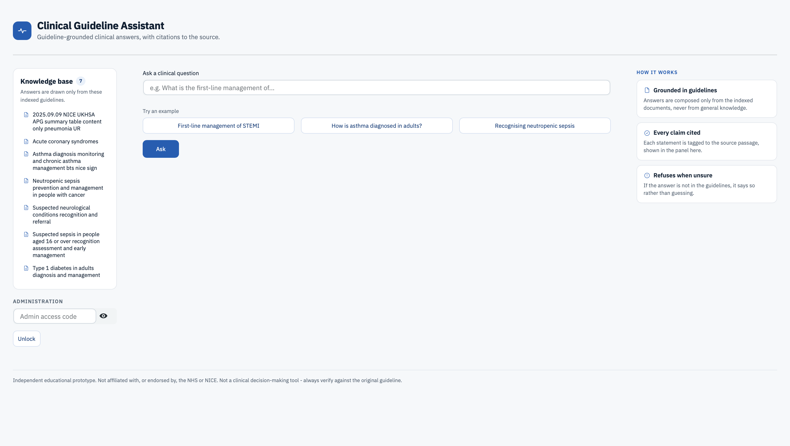
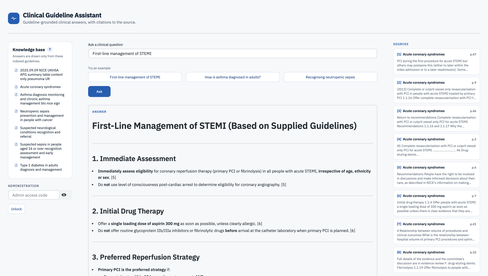
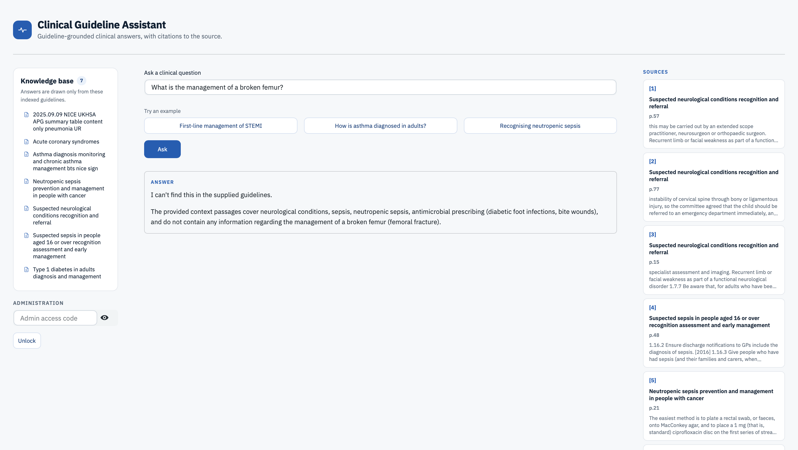
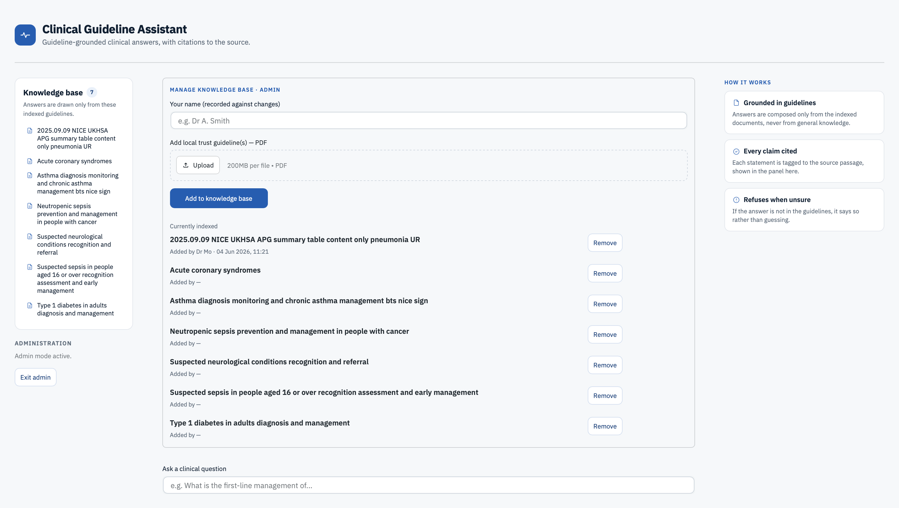

# Clinical Guideline Assistant

A retrieval-augmented (RAG) question-answering tool for clinical guidelines. It
answers questions **using only the guideline documents it has been given**,
**cites the exact source passage** behind every claim, and **refuses to answer**
when the information isn't in the indexed guidelines — rather than guessing.

Built by a doctor, with trust and explainability as the design goal: a clinician
can always see where an answer came from, and the model is constrained from
inventing content beyond the source material. Designated administrators can
curate the knowledge base — adding or removing local trust guidelines — through
the interface, without touching the command line.

> ⚠️ Independent educational prototype. Not affiliated with, or endorsed by, the
> NHS or NICE. Not a clinical decision-making tool — always verify against the
> original guideline.

## Screenshots



| Answer with citations | Refusal when out of scope | Admin knowledge base |
| --- | --- | --- |
|  |  |  |

## Key features

- **Grounded answers** — responses are composed only from the indexed guideline
  text, never from the model's general knowledge.
- **Inline citations** — every statement is tagged to the numbered source
  passage it came from, shown alongside the answer.
- **Refusal guardrail** — if the answer isn't in the supplied guidelines, the
  assistant says so instead of fabricating one. This is the core safety feature.
- **Admin-curated knowledge base** — an access-gated panel lets authorised users
  upload or remove guideline PDFs, which are indexed into the live store
  immediately. Each change records who made it and when.
- **Clinical-software UI** — a clean, accessible interface using the NHS colour
  palette and conventions (used as an inspiration, not an official branding).

## How it works

```
   PDFs (guidelines/)                 Admin upload (in-app)
            \                                /
             \                              /
              v                            v
        [ rag.py ]  split into chunks -> embed each chunk -> store in vector DB
                                                |
                                          chroma_db/ (on disk)
                                                |
   Question --> embed --> retrieve closest chunks --> ask the LLM to answer
                                                       using ONLY those chunks,
                                                       with citations, or refuse
                                                |
                                           [ app.py ]  question in, cited answer
                                                        + source passages out
```

The on-disk index is a **derived artefact**: the original PDFs in `guidelines/`
plus a manifest (`guidelines_meta.json`, recording who added what and when) are
the record of what should be indexed, so the index can always be rebuilt from
them with `python ingest.py`.

## Tech stack

- **Python**
- **sentence-transformers** (`all-MiniLM-L6-v2`) — local embeddings, no API needed
- **ChromaDB** — local persistent vector store
- **pypdf** — reading source documents
- **Anthropic API** — grounded answer generation
- **Streamlit** — interface

## Setup

```bash
# 1. Create and activate a virtual environment
python3 -m venv .venv
source .venv/bin/activate

# 2. Install dependencies
pip install -r requirements.txt

# 3. Configure secrets
cp .env.example .env
# then edit .env and set:
#   ANTHROPIC_API_KEY=sk-ant-...        (from https://console.anthropic.com)
#   ADMIN_PASSWORD=choose-a-code        (unlocks the admin panel)

# 4. Add some guideline PDFs to the guidelines/ folder (optional first load)

# 5. Build the index
python ingest.py

# 6. Run the app
streamlit run app.py
```

> Note: if you change any `.py` file, stop the app (Ctrl+C) and relaunch — the
> file watcher is disabled for stability, so a browser refresh won't reload code.

## Using the admin panel

Enter the admin access code in the **Administration** box (lower left), then:

- **Add** one or more guideline PDFs — they're saved, indexed, and searchable
  immediately, recorded against the name you provide.
- **Remove** a guideline — deletes it from the index, the folder, and the record.

## Production considerations

This is a prototype. A real trust deployment would add:

- **Authentication** — NHS login / SSO and named user accounts, replacing the
  shared access code.
- **Audit logging** — a full, tamper-evident record of every change and, ideally,
  every query and answer (a lightweight version of this exists via the manifest).
- **A managed vector store** — a hosted/managed database rather than a local
  ChromaDB file, once multiple users write concurrently.
- **Review / approval workflow** — clinical sign-off before a guideline goes live.
- **Versioning** of guidelines, so answers can be traced to a specific revision.

## Limitations

- Answer quality depends entirely on the guidelines indexed.
- Scanned / image-only PDFs need OCR first (not included).
- Retrieval is semantic similarity, not clinical reasoning — always verify
  against the cited source.

## A note on source documents

Add only PDFs you are entitled to use. Documents are processed locally; the PDFs
themselves are git-ignored and never committed, so no copyrighted content is
redistributed. Some sources (e.g. licensed formularies) carry usage restrictions
— respect them.